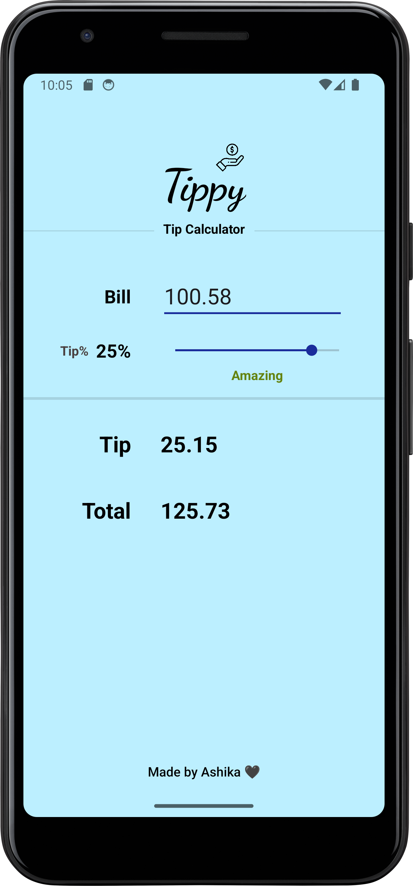

# Tippy
A basic minimalist tip calculator app, built with Kotlin in Android Studio.

## Features 🌟

- Calculate tip and total bill amount with a maximum 30% tip percent.
- Adjust tip percent with a swipe of your finger using our intuitive slider.
- Watch as the tip description dynamically changes color based on your chosen tip percent.

   
  
## Technologies Used 

- Kotlin
- Android Studio

## Upcoming Enhancements 

- Easily split the bill among N people.
- Round the final amount up or down to your liking.
- Upgrade design and colors

## How to Run 🏃

1. Clone this repository to your local machine.
```
git clone https://github.com/achakravorty/tippy-app.git
```
2. Open the project in .
3. Build and run the project on an emulator or physical device.

## Contributing

If you'd like to contribute to this collection by adding new problems or improving existing solutions, feel free to fork the repository and submit a pull request.

## License

This repository is licensed under the [MIT License](LICENSE).

---

Happy coding! 🚀

